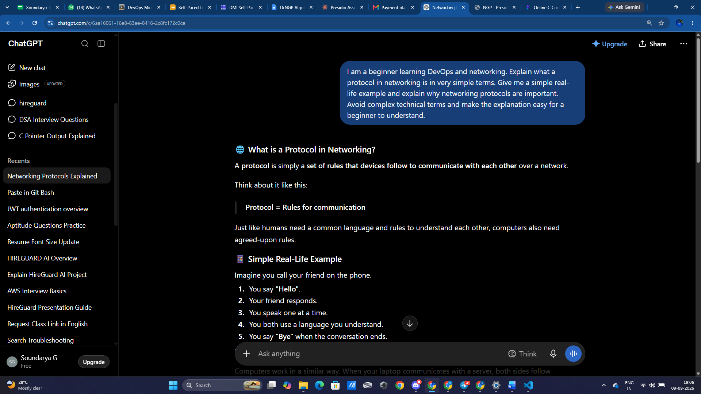
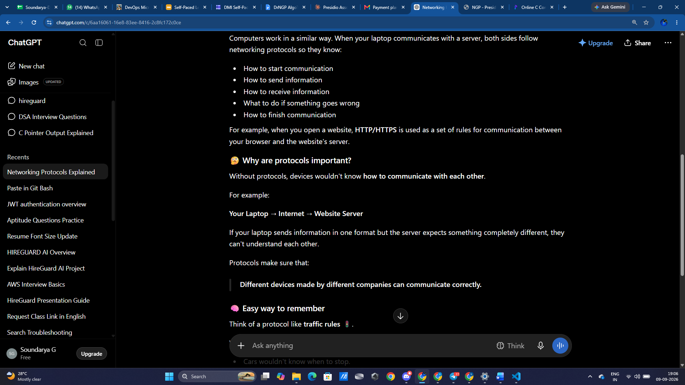
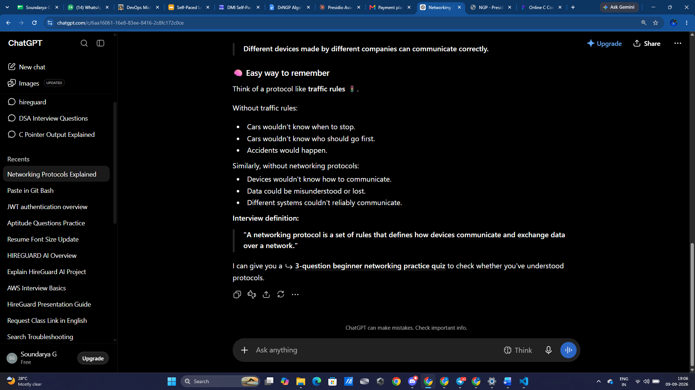
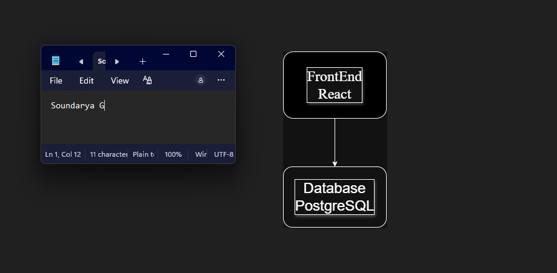
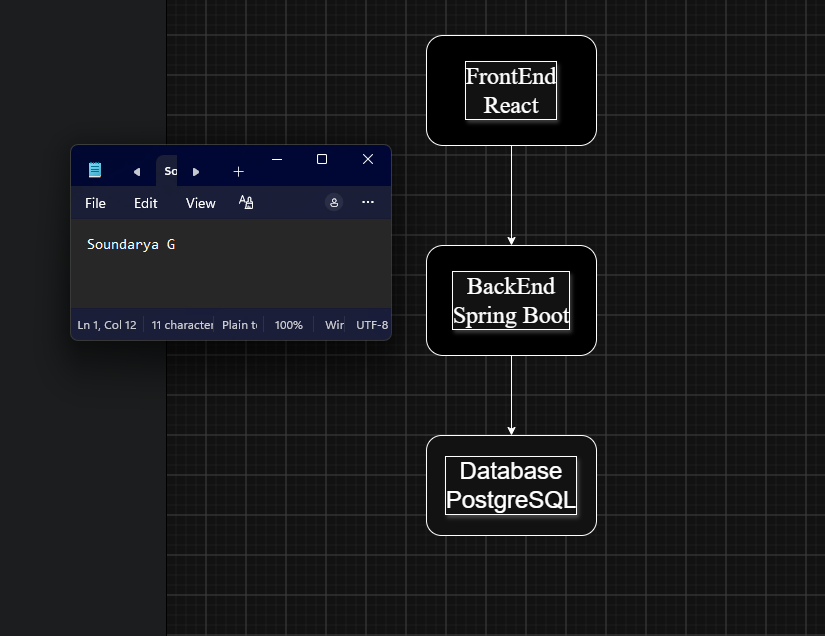
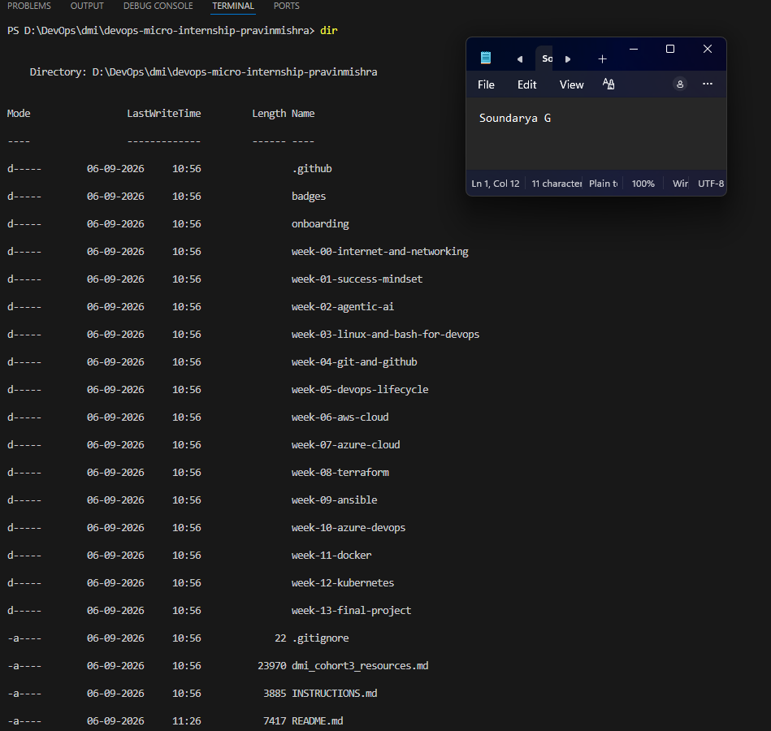

# Week 00 - Internet and Networking

Part of the DevOps Micro Internship (DMI) Cohort 3 with Agentic AI

---

# 🧑‍💻 Task 1: Using ChatGPT as Your Learning Assistant

## Scenario

You're new to DevOps and will frequently encounter technical questions. ChatGPT can be your learning companion.

## Your Task

Write a clear ChatGPT prompt to help you understand:

> "What is a protocol in networking? Explain with a simple real-life example."

Take a screenshot of your interaction showing:

* Your detailed prompt (with clear expectations)
* ChatGPT's simplified response with an example

## Screenshot







---

## What I Learned 

I learned that a networking protocol is a set of rules used by devices to communicate with each other. I also understood how protocols help devices exchange data correctly.


---

# 🌐 Task 2: Internet and Networking

## Scenario

Your friend is launching an online bookstore named **EpicReads**.

He asked you to explain how users globally can access his website hosted in Finland.

## Your Task

Write a short explanation (**100–150 words**) that includes:

* Packet Switching
* IP Address
* TCP/IP
* HTTP/HTTPS

💡 **Tip:** You may use ChatGPT (as demonstrated in Task 1) to refine your explanation.

## Answer

When a user accesses the EpicReads website, the data is divided into small units called packets. These packets travel through different networks using packet switching and reach the server hosted in Finland. The server has an IP address that uniquely identifies it on the internet. TCP/IP is responsible for communication between the user's device and the server. IP handles addressing and routing, while TCP helps deliver the data reliably and in the correct order. HTTP or HTTPS is used for communication between the browser and the web server. HTTPS is more secure because it encrypts the data during transmission. Finally, the response from the Finland server is divided into packets and sent back to the user's device, where the browser reconstructs the data and displays the EpicReads website.


---

# 🏗️ Task 3: Application Architecture & Stack

## Scenario

EpicReads bookstore has two application versions:

### Two-Tier Application

* Frontend
* Database

### Three-Tier Application

* Frontend
* Backend
* Database

## Your Task

* Draw simple diagrams (hand-drawn or tool-based such as draw.io)
* Label each layer clearly
* List at least two common technologies or tools used for each layer
* Submit a screenshot or photo clearly showing your own drawing

## Diagram Screenshot / Photo






## Technologies Used

### Frontend

* React
*Html/CSS

### Backend

* Spring Boot
* Node.js

### Database

* PostgreSQL
*MySQl
---

# 🌍 Task 4: Domain Name & DNS (Basic Concepts)

## Scenario

Your friend's bookstore **EpicReads** is currently accessible through:

```text
52.172.142.222:3000
```

He purchased the domain:

```text
epicreads.com
```

## Your Task

In **50–100 words**, explain in your own words:

1. What is DNS (Domain Name System)?
2. Which DNS record type should be used to connect the domain to the given IP, and why?

## Answer

DNS (Domain Name System) is used to convert a human-readable domain name into an IP address. Instead of remembering 52.172.142.222, users can simply enter epicreads.com. An A record should be used because it connects a domain name to an IPv4 address. Therefore, the A record can point epicreads.com to 52.172.142.222. The port number 3000 is not part of the DNS record and is handled separately by the application or server.


---

# 💻 Task 5: Visual Studio Code Setup (Hands-on)

## Your Task

Install Visual Studio Code (if not already installed).

Take a screenshot of your VS Code environment showing:

* Terminal open inside VS Code
* Running a basic command:

### Windows

```powershell
dir
```

### Linux / macOS

```bash
pwd
ls
```

* Your selected VS Code theme clearly visible


## Screenshot





---

# 🔗 Task 6: Publish Your Assignment as a LinkedIn Post

## Objective

Publishing on LinkedIn helps you:

* Build your professional online presence
* Reinforce your learning
* Document your DevOps journey publicly

## Your Task

Summarize your answers from Tasks 1–5 into a LinkedIn post.

Clearly structure your post into the following sections:

* ChatGPT
* Internet & Networking
* App Architecture
* DNS
* VS Code Setup

Add the following credit note at the end of your post:

> **P.S. This post is part of the DevOps Micro Internship (DMI) with Agentic AI — Cohort 3 — by Pravin Mishra. My graded progress is public: https://dmi.pravinmishra.com/s/YOUR-GITHUB-USERNAME.html · Start your DevOps journey: https://dmi.pravinmishra.com/?utm_source=student&utm_medium=ps-linkedin&utm_campaign=cohort3**

---

## LinkedIn Post URL

Paste your LinkedIn post URL here:

```text
https://lnkd.in/p/g9f6ABFH
```

---

## LinkedIn Post Backup Copy

Paste the full text of your LinkedIn post here:

🚀 Week 00 of my DevOps Micro Internship (DMI) – Cohort 3

I started my DevOps journey by learning the fundamentals of networking, application architecture, DNS, and developer tools.

🔹 ChatGPT
Learned how to create effective prompts and use ChatGPT as a learning assistant to understand networking concepts.

🔹 Internet & Networking
Learned about packet switching, IP addresses, TCP/IP, and HTTP/HTTPS and how they work together when accessing websites.

🔹 App Architecture
Understood the difference between two-tier and three-tier architectures and the roles of frontend, backend, and database layers.

🔹 DNS
Learned how DNS maps domain names to IP addresses and understood the purpose of an A record.

🔹 VS Code Setup
Set up VS Code and practiced using its integrated terminal.

This week gave me a strong foundation for continuing my DevOps learning journey. 🚀

#DevOps #DMI #DevOpsMicroInternship #Networking #Cloud #LearningJourney #Cohort3

P.S. This post is part of the DevOps Micro Internship (DMI) with Agentic AI — Cohort 3 — by Pravin Mishra. My graded progress is public: https://dmi.pravinmishra.com/s/soundarya635.html · Start your DevOps journey: https://dmi.pravinmishra.com/?utm_source=student&utm_medium=ps-linkedin&utm_campaign=cohort3

---

# Reflection – Week 0

### What did you find easy?

I found the basic networking concepts and VS Code setup easy to understand and practice.


---

### What was difficult?

Understanding how packet switching, TCP/IP, DNS, and application architecture work together was initially challenging.


---

### What will you improve next week?

Next week, I will focus on learning DevOps tools and getting more hands-on practice with Linux, Git, and cloud concepts.


---

## 📌 About DMI & CloudAdvisory

DevOps Micro Internship (DMI) is a project-based DevOps program run by Pravin Mishra (The CloudAdvisory) focused on real-world execution, systems thinking, and career readiness.

It helps learners build strong DevOps foundations with hands-on experience.


## 📌 Resources

- 🌐 **DMI Official Website:** https://dmi.pravinmishra.com?utm_source=github&utm_medium=readme  
- 🎓 **University:** https://university.pravinmishra.com?utm_source=github&utm_medium=readme  
- 💬 **Discord Community:** https://discord.pravinmishra.com?utm_source=github&utm_medium=readme  
- 📝 **Blog:** https://dmi.pravinmishra.com/blog?utm_source=github&utm_medium=readme  
- ▶️ **YouTube Playlist (DMI Cohort 3):** https://www.youtube.com/playlist?list=PLFeSNDtI4Cho  
- 🔗 **Pravin Mishra (LinkedIn):** https://www.linkedin.com/in/pravin-mishra-aws-trainer/  
- 🏢 **CloudAdvisory (LinkedIn):** https://www.linkedin.com/company/thecloudadvisory/

---

*This submission is part of DevOps Micro Internship (DMI) Cohort 3 — Agentic AI Track*